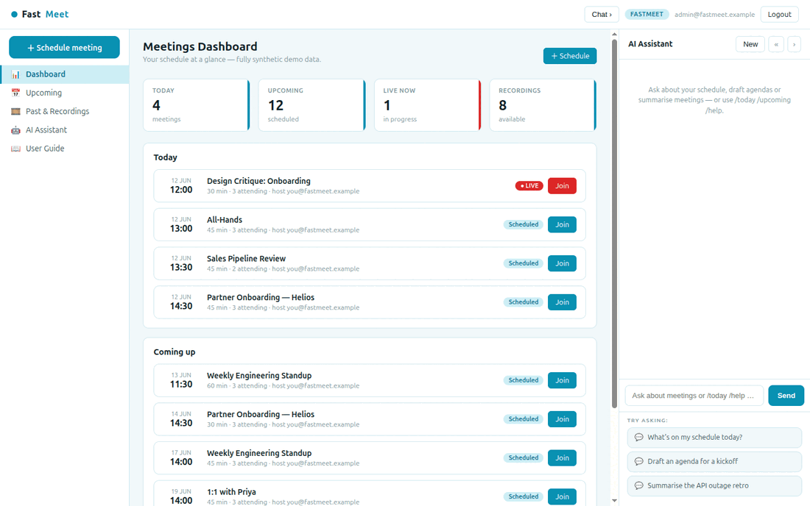

# FastMeet

**FastMeet** is an open-source **meeting scheduler** built with
[FastHTML](https://fastht.ml) — a server-side, HTMX-driven port of the
scheduling & rooms half of [Frappe Meet](https://github.com/frappe/meet).
Python-first, no JavaScript framework: a dashboard, upcoming/past meetings,
meeting detail with participants & agenda, a (simulated) room lobby, scheduling,
and **AI agenda generation + meeting summaries**.

*Meetings, organised.* Runs on port **5015**.

> **Synthetic data only.** Meetings and participants are generated by `seed.py`.

> **No live video.** Real audio/video uses WebRTC, which a server-rendered app
> can't carry. FastMeet does everything *around* the call — see the roadmap for
> embedding a media layer (LiveKit / Jitsi).

## Demo



## Quickstart (native)

```bash
python -m venv .venv
.venv/bin/python -m pip install -r requirements.txt
cp .env.sample .env          # add an LLM key for AI agendas/summaries + chat
.venv/bin/python web_app.py  # http://localhost:5015  (self-seeds on first boot)
```

Login: `admin@fastmeet.example` / `FastMeet2026$`. Reseed with
`.venv/bin/python seed.py`.

## Run with Docker

```bash
docker compose up --build      # http://localhost:5015
```

`Dockerfile` (python:3.12-slim, port 5015) seeds on first boot;
`docker-compose.yml` mounts a `fastmeet-data` volume at `/data`.

## Module tour

- **Dashboard** (`/`) — today's & upcoming meetings, live-now, recordings; a
  blinking **LIVE** badge on in-progress meetings.
- **Meetings** (`/meetings?scope=`) — **Upcoming** and **Past & Recordings**.
- **Meeting detail** (`/meeting/{id}`) — details, **participants with RSVPs**,
  agenda, room code, and recording/summary for past meetings.
- **Room** (`/room/{id}`) — a lobby showing who's present with simulated tiles
  and call controls (honest about the WebRTC limitation).
- **Schedule** (`/schedule`) — create a meeting and invite people.
- **AI Assistant** (right rail) — schedule Q&A; **generate an agenda** from a
  meeting's title/participants and **summarise** past meetings (per-meeting
  buttons). Slash-commands `/today`, `/upcoming` work with **no API key**.

## Architecture

```
web_app.py        routes, auth, schedule, AI agenda/summary, SSE chat
db.py             SQLite meetings + participants
seed.py           deterministic synthetic schedule (+ a live meeting)
web/layout.py     3-pane shell, room/video-tile CSS, chat JS
web/views.py      dashboard, lists, meeting detail, room, schedule
web/ai.py         generate_agenda() / summarise_meeting() + grounded chat
```

See **[SKILLS.md](SKILLS.md)** and **[docs/ROADMAP.md](docs/ROADMAP.md)** (incl. the
WebRTC note). Part of the
[`fasthtml-oss-migrations`](https://github.com/predictivelabsai/fasthtml-oss-migrations)
initiative.

## Licence

MIT.
