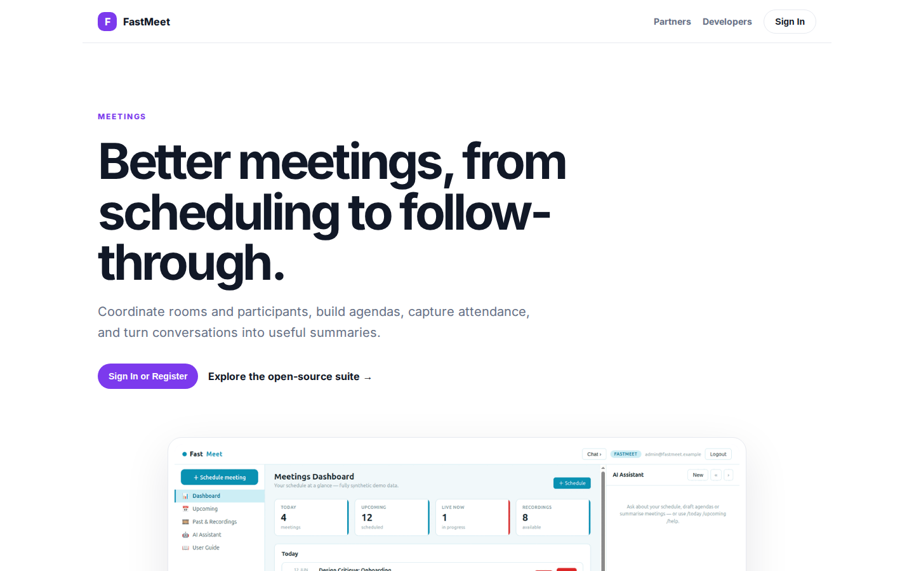
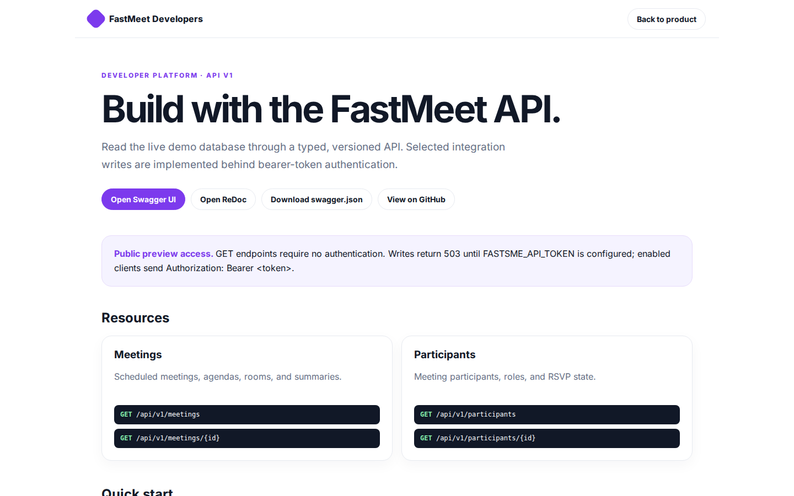

# FastMeet Platform Guide

**Published:** 2026-08-19
**Platform:** [https://meet.fastsme.com](https://meet.fastsme.com)
**Source:** [github.com/predictivelabsai/FastMeet](https://github.com/predictivelabsai/FastMeet)

## Platform overview

**FastMeet** is an open-source **meeting scheduler** built with — a server-side, HTMX-driven port of the scheduling & rooms half of . Python-first, no JavaScript framework: a dashboard, upcoming/past meetings, meeting detail with participants & agenda, a (simulated) room lobby, scheduling, and **AI agenda generation +

This visual guide was reviewed against the live product using Playwright. Screens and available navigation can vary by account, role, and deployment configuration.

## 1. Better meetings, from scheduling to follow-through.

MEETINGS Better meetings, from scheduling to follow-through. Coordinate rooms and participants, build agendas, capture attendance, and turn conversations into useful summaries. Sign In or Register Explore the open-source suite → Product tour · see the workspac

Screen reviewed at: [https://meet.fastsme.com/](https://meet.fastsme.com/)

## 2. Build with the FastMeet API.

FastMeet Developers Back to product DEVELOPER PLATFORM · API V1 Build with the FastMeet API. Read the live demo database through a typed, versioned API. Selected integration writes are implemented behind bearer-token authentication. Open Swagger UI Open ReDoc

Screen reviewed at: [https://meet.fastsme.com/developers](https://meet.fastsme.com/developers)

## 3. Sign in

Sign in with Google Sign in to continue to fastsme.com Email or phone Forgot email? Next Create account Afrikaans azərbaycan bosanski català Čeština Cymraeg Dansk Deutsch eesti English (United Kingdom) English (United States) Español (España) Español (Latinoam

Screen reviewed at: [https://accounts.google.com/v3/signin/identifier?opparams=%253F&dsh=S-331771831%3A1787122800311098&access_type=online&client_id=887059023987-2a7spj1m82eivobdbt1itb3cqca6tpt1.apps.googleusercontent.com&o2v=2&prompt=select_account&redirect_uri=https%3A%2F%2Fmeet.fastsme.com%2Fauth%2Fgoogle%2Fcallback&response_type=code&scope=openid+email+profile&service=lso&state=-K8IQRtF7Q44ozfnLys-8TKCYHqkqDg0rRzI5opS7b0&flowName=GeneralOAuthLite&continue=https%3A%2F%2Faccounts.google.com%2Fsignin%2Foauth%2Flegacy%2Fconsent%3Fauthuser%3Dunknown%26part%3DAJi8hAOY3ev1p_Co15ZcKcWm36b0xLHdJJJbs2xvOm5dcmc5TNGzG_2rygi3SNgq194eODNxI3BSM-h_x2lKzhS0EG3eE552PYoLnBv3TyYkHJU05HcvaMO6wwjzwNP8EFBvs5QIjUw8_DSETbI4eDVz8uMCpprzuhKvg2PDgvLnBF1TU66VXO1tun2IJPF7KvmhKUa3AkLhfuAabwyTQpeod_Gvj-B2vdq8PQBvMaKv-n-S5S2kF99I4c941kArcgoiBkbYkiUF3tJCkim6f_9zFGxxBzjxoD5Q8jxS6L8pym6Yz4gVPfbGdb3oZJO6gX7gfxQVcFc4Po1x4ao26lAKarTXAWw8qv8qVAfjpaigtij6e0VkR-kxKezQ9QrJ6U2wEz42BjqV-ei3Fr-ZLBtLez1YRF2Te4DJyutvoSgyvKUl0XlzUnJhcUtxQMC1EZCB-fDs_zeIEZ4zwAtht8suByFcaOjHRg%26flowName%3DGeneralOAuthFlow%26as%3DS-331771831%253A1787122800311098%26client_id%3D887059023987-2a7spj1m82eivobdbt1itb3cqca6tpt1.apps.googleusercontent.com%23&app_domain=https%3A%2F%2Fmeet.fastsme.com&rart=ANgoxcfDSbdsWfDqB_xDUQ6Z0KqF4G0F3JHrGOhfLlw08T4YR8q781ZfKQYGsT6E75bXd65MEF_fJnCSRQcmG-F10z0mp-EUy4hCPW8rOUkIw_Zs_pWfJvI](https://accounts.google.com/v3/signin/identifier?opparams=%253F&dsh=S-331771831%3A1787122800311098&access_type=online&client_id=887059023987-2a7spj1m82eivobdbt1itb3cqca6tpt1.apps.googleusercontent.com&o2v=2&prompt=select_account&redirect_uri=https%3A%2F%2Fmeet.fastsme.com%2Fauth%2Fgoogle%2Fcallback&response_type=code&scope=openid+email+profile&service=lso&state=-K8IQRtF7Q44ozfnLys-8TKCYHqkqDg0rRzI5opS7b0&flowName=GeneralOAuthLite&continue=https%3A%2F%2Faccounts.google.com%2Fsignin%2Foauth%2Flegacy%2Fconsent%3Fauthuser%3Dunknown%26part%3DAJi8hAOY3ev1p_Co15ZcKcWm36b0xLHdJJJbs2xvOm5dcmc5TNGzG_2rygi3SNgq194eODNxI3BSM-h_x2lKzhS0EG3eE552PYoLnBv3TyYkHJU05HcvaMO6wwjzwNP8EFBvs5QIjUw8_DSETbI4eDVz8uMCpprzuhKvg2PDgvLnBF1TU66VXO1tun2IJPF7KvmhKUa3AkLhfuAabwyTQpeod_Gvj-B2vdq8PQBvMaKv-n-S5S2kF99I4c941kArcgoiBkbYkiUF3tJCkim6f_9zFGxxBzjxoD5Q8jxS6L8pym6Yz4gVPfbGdb3oZJO6gX7gfxQVcFc4Po1x4ao26lAKarTXAWw8qv8qVAfjpaigtij6e0VkR-kxKezQ9QrJ6U2wEz42BjqV-ei3Fr-ZLBtLez1YRF2Te4DJyutvoSgyvKUl0XlzUnJhcUtxQMC1EZCB-fDs_zeIEZ4zwAtht8suByFcaOjHRg%26flowName%3DGeneralOAuthFlow%26as%3DS-331771831%253A1787122800311098%26client_id%3D887059023987-2a7spj1m82eivobdbt1itb3cqca6tpt1.apps.googleusercontent.com%23&app_domain=https%3A%2F%2Fmeet.fastsme.com&rart=ANgoxcfDSbdsWfDqB_xDUQ6Z0KqF4G0F3JHrGOhfLlw08T4YR8q781ZfKQYGsT6E75bXd65MEF_fJnCSRQcmG-F10z0mp-EUy4hCPW8rOUkIw_Zs_pWfJvI)

## Getting started

Visit [https://meet.fastsme.com](https://meet.fastsme.com) to explore FastMeet. For source code and deployment details, use the GitHub link above.
